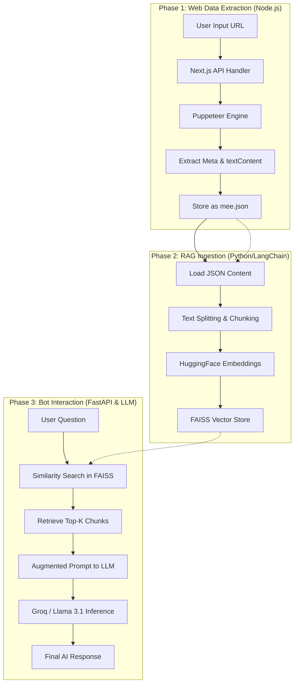

# 🤖 LeadForGrow: RAG Intelligence System Guide

Welcome to the **RAG (Retrieval-Augmented Generation)** implementation guide for LeadForGrow. This document explains how we transform static website data into an interactive, knowledgeable AI assistant.

---

## 👥 Team Distribution (The Core Triad)

To maintain this system effectively, the responsibilities are divided into three specialized roles:

### 1. 🕸️ The Scraper Expert (Data Extraction)
**Responsibility**: Ensuring high-quality data is pulled from the web.
- **Key Files**: `lib/scraper.js`, `app/api/scrape/route.js`, `app/scrape/page.js`
- **Focus**: Managing Puppeteer instances, handling anti-bot measures, cleaning extracted `textContent`, and ensuring the resulting JSON is structured and complete.

### 2. 🧠 The RAG Expert (AI & Vector Flow)
**Responsibility**: Managing the "Brain" — Chunking, Embeddings, and Retrieval.
- **Key Files**: `backend-ai/rag_utils.py`, `backend-ai/main.py`, `faiss_index/`
- **Focus**: Fine-tuning text splitting (chunk size/overlap), maintaining the FAISS vector database, optimizing the Groq (Llama 3.1) system prompts, and ensuring low-latency retrieval.

### 3. 🎨 The Frontend/Bot Expert (User Experience)
**Responsibility**: The Interface & Bot Personification.
- **Key Files**: `app/rag-test/page.jsx`, `app/components/AiCopilotCard.jsx`
- **Focus**: Handling the chat UI, managing message states, implementing smooth loading animations (skeletons/bouncing dots), and connecting the Next.js frontend to the Python AI backend.

---

## 📂 File-by-File Implementation

### 🌐 Frontend & Scraping Layer
| File | Purpose |
|:---|:---|
| **`lib/scraper.js`** | Uses **Puppeteer** to launch a headless browser, navigate to a URL, and extract Title, Meta Tags, and the full `textContent`. It cleans the text to ensure it's "LLM-ready". |
| **`app/api/scrape/route.js`** | The Next.js API handler that receives a URL, calls the library scraper, and returns the structured JSON data. |
| **`app/scrape/page.js`** | A premium dashboard interface for users to trigger the scraping process and visualize the results (Headings, Links, Images, etc.). |

### 🛰️ AI Backend (Python/FastAPI)
| File | Purpose |
|:---|:---|
| **`backend-ai/main.py`** | The **FastAPI** server hosting the `/ai/rag-chat` endpoint. It acts as the bridge between the frontend and the RAG logic. |
| **`backend-ai/rag_utils.py`** | The heart of the RAG system. It uses **LangChain** to load `mee.json`, split text into chunks of 500 characters, generate vectors using `HuggingFaceEmbeddings`, and query the **Groq** cloud engine (Llama 3.1). |
| **`faiss_index/`** | A local directory where the vectorized representation of your website data is stored. This allows for lightning-fast semantic searches without re-processing the site every time. |

### 💬 Interaction Layer
| File | Purpose |
|:---|:---|
| **`app/rag-test/page.jsx`** | A dedicated testing ground for the chatbot. It sends user queries to the local Python server and displays the AI's "thought-out" answers based on the scraped context. |

---

## 🔄 The Full Data Pipeline (Step-by-Step)

### 1. Web Scraping Phase
- **Input**: User enters `https://example.com` in the Scraper UI.
- **Action**: `lib/scraper.js` navigates to the site, waits for "networkidle", and pulls everything from `<p>`, `<h1>`, and `<meta>` tags.
- **Output**: A structured `mee.json` file containing the "soul" of the website.

### 2. RAG Ingestion Phase (The "Study" Phase)
- **Action**: `rag_utils.py` reads `mee.json`.
- **Chunking**: Text is broken into smaller pieces (500 chars) so the AI can point to specific sections.
- **Vectorization**: Each chunk is converted into a mathematical sequence (Embedding).
- **Indexing**: These sequences are saved into **FAISS** (Facebook AI Similarity Search).

### 3. Bot Creation & Querying (The "Chat" Phase)
- **User Question**: "What are the pricing plans for LeadForGrow?"
- **Retrieval**: The system searches FAISS for the 3 chunks most similar to the question.
- **Generation**: The question + those 3 chunks are sent to **Groq/Llama 3.1** with a prompt: *"Answer ONLY using this context."*
- **Response**: The bot replies: *"Starter is FREE, Pro is ₹5,000, and Done-For-You is ₹20,000..."*

---


---

## 🗺️ System Architecture Workflow



---

## 🚀 The End-to-End Flow Explained (Briefly)

### 1. **Data Harvesting (Node.js/Puppeteer)**
The journey starts when a user provides a website URL. Our **Puppeteer-based Scraper** acts like a human visitor—it browses the site, waits for JavaScript to load, and pulls all meaningful text, headings, and metadata. This high-density data is then saved into a structured **`mee.json`** file.

### 2. **Knowledge Transformation (LangChain/HuggingFace)**
Once we have our JSON, the **RAG Engine** takes over. It breaks down the massive block of text into smaller, manageable "chunks" (500 characters each). Each chunk is then converted into a unique mathematical signature (an **Embedding**) and stored in a local **FAISS Vector Database**. This database allows us to search for relevant info semantically rather than just by keyword.

### 3. **Intelligent Retrieval (FastAPI/Groq)**
When a user asks a question (e.g., *"What services do you offer?"*), the system translates the question into a vector and searches the **FAISS Database** for the most similar chunks of information. It "retrieves" only the relevant data needed to answer that specific question.

### 4. **Grounded Generation (Llama 3.1/FastAPI)**
The system takes the user's question and combines it with the retrieved chunks to create a **Context-Aware Prompt**. Instead of answering from general knowledge, the **LLM (Llama 3.1 on Groq)** uses this specific context to generate a factual, grounded response. The result is an AI that speaks with the knowledge of *your* specific website data.

---

## 🚀 How to Run the Ecosystem


### 💻 1. Start the Frontend (Next.js)
```bash
npm run dev
# Dashboard at http://localhost:3000/scrape
# Chatbot at http://localhost:3000/rag-test
```

### ⚡ 2. Build the AI Brain (Python)
Ensure you have your `GROQ_API_KEY` in `backend-ai/.env`.
```bash
cd backend-ai
python rag_utils.py  # This builds the FAISS index from mee.json
```

### 🤖 3. Launch the AI Server
```bash
python main.py
# Server runs at http://localhost:5055
```

---

> [!TIP]
> **Why Groq + FAISS?**
> We use FAISS locally for privacy and cost-efficiency (free), and Groq for the LLM because it is the fastest inference engine currently available (Llama 3.1 responses in < 1 second).
