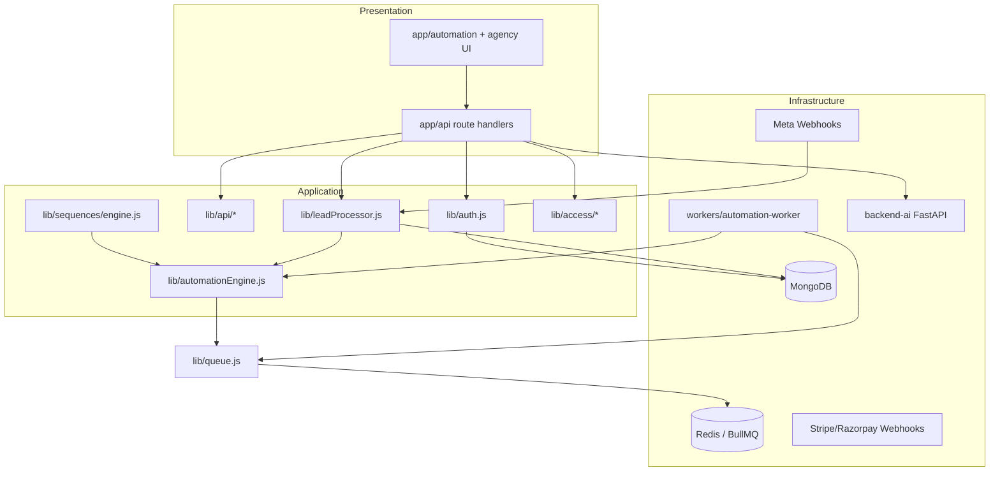

# LeadForGrow Phase 1 — Codebase Audit

**Date:** June 2026 · **Phase:** 1 of 8 (Foundation)  
**Build status:** Passing · **API routes:** ~137 · **Models:** 46

---

## Executive Summary

LeadForGrow is a **Next.js 16 + MongoDB modular monolith** with a WhatsApp-first CRM at `/automation`, agency console at `/agency`, embed widgets, BullMQ automation worker, and Python AI backend.

**Previous audit (May 2026)** identified auth fragmentation, missing tests, and no Docker. **This audit confirms partial remediation** and documents remaining Phase 1 work.

### Remediation Since Last Audit

| Area | Status |
|------|--------|
| Global `middleware.js` with JWT gate | ✅ Done |
| Legacy `x-user-id` / `?userId=` rejection | ✅ Done |
| `lib/env.js` production validation | ✅ Done |
| Hardcoded MongoDB URI removed | ✅ Done |
| Cron secret on cron routes | ✅ Done |
| Debug routes blocked in production | ✅ Done |
| Rate limiting (Redis-backed) | ✅ Partial |
| Webhook signature verification (Meta) | ✅ Done |
| Audit logging (`lib/auditLog.js`) | ✅ Done |
| Secure headers (middleware + next.config) | ✅ Done |
| Refresh token strategy | ✅ Added Phase 1 |
| API platform layer (`lib/api/`) | ✅ Added Phase 1 |
| Base schema plugin | ✅ Added Phase 1 |
| Docker + docker-compose | ✅ Added Phase 1 |
| Migration framework | ✅ Added Phase 1 |
| Health check endpoint | ✅ Added Phase 1 |
| Test foundation | ✅ Expanded Phase 1 |

---

## Folder Structure

```
LeadForGrow-1/
├── app/                    # Next.js App Router (Presentation)
│   ├── api/                # 137 REST route handlers
│   ├── automation/         # CRM workspace UI
│   ├── agency/             # Agency console UI
│   ├── components/         # Shared + landing UI
│   ├── lfgadmin/           # Super-admin
│   └── user/               # Auth + legacy user portal
├── lib/                    # Application + Infrastructure
│   ├── api/                # API platform (response, handler, pagination)
│   ├── security/           # CSRF, sanitize, refresh tokens
│   ├── access/             # RBAC middleware + resolver
│   ├── automation/         # Lead manager, engine facade
│   ├── billing/            # Stripe, Razorpay, plans
│   ├── call-automation/    # Telephony domain
│   ├── integrations/       # WhatsApp, email, OAuth
│   ├── meetings/           # Booking engine
│   ├── meta/               # Meta ads + webhooks
│   ├── realtime/           # SSE hub
│   ├── sequences/          # Graph sequence engine
│   ├── auth.js             # JWT + withAuth
│   ├── mongodb.js          # Connection pool
│   ├── queue.js            # BullMQ
│   └── leadProcessor.js    # Lead ingest pipeline
├── models/                 # Mongoose schemas (46)
├── workers/                # Automation worker process
├── scripts/                # Migrations, indexes, smoke tests
├── tests/                  # Unit + security tests
├── backend-ai/             # Python FastAPI RAG service
└── public/                 # Static + embed widgets
```

---

## Dependency Graph



---

## API Inventory (by domain)

| Domain | Routes | Auth |
|--------|--------|------|
| `/api/automation/*` | 45+ | JWT + tenant |
| `/api/agency/*` | 12 | JWT + agency guard |
| `/api/integrations/*` | 10 | JWT |
| `/api/business/*` | 8 | JWT |
| `/api/auth/*` | 4 | Public (login/register/refresh) |
| `/api/webhooks/*` | 8 | Signature/token |
| `/api/cron/*` | 2 | CRON_SECRET |
| `/api/public/*` | 3 | Rate limited |
| `/api/forms/*` | 4 | Mixed |
| `/api/ai/*` | 7 | JWT |
| `/api/health` | 1 | Public |

---

## Models (46)

**Core:** User, Business, Agency, Client, Form, Website, Integration  
**Automation:** Lead, Task, Activity, Deal, Message, WhatsAppConversation, AutomationRule, AutomationSequence, TeamMember, Notification, Event, WebhookLog, LeadSource  
**Access:** UserAccess, WorkspaceRole, ApiKey, AccessAuditLog, RefreshToken  
**Billing:** Subscription, UsageRecord, Invoice  
**Meetings:** MeetingType, MeetingBooking, MeetingAvailability, MeetingReminder, MeetingAnalytics  
**CMS (legacy):** cms/Client, ServiceTask, ActivityLog, Invoice  
**Other:** ConsentLog, OnboardingCall, AgencyUsage, MetaWebhookIngress, SequenceExecution

---

## Integrations

| Integration | Location | Notes |
|-------------|----------|-------|
| Meta WhatsApp | `lib/meta/*`, `lib/integrations/whatsapp.js` | Webhook HMAC verified |
| Interakt | `app/api/integrations/webhooks/interakt-reply` | Token optional |
| Stripe | `lib/billing/stripe.js` | Webhook route exists |
| Razorpay | `lib/billing/razorpay.js` | Webhook route exists |
| Google Calendar | `lib/googleCalendar.js` | OAuth |
| Twilio/Vapi | `lib/call-automation/*` | Call automation |
| Cloudinary | Upload routes | Signed uploads |
| Resend/Nodemailer | `lib/integrations/email.js` | Business email |

---

## Issues Identified

### P0 Security (Addressed in Phase 1)
- ~~Legacy auth bypass~~ → Rejected globally
- ~~Missing env validation~~ → `lib/env.js`
- ~~Cron unprotected~~ → CRON_SECRET required in prod
- Refresh token rotation → `POST /api/auth/refresh`

### P1 Security (Ongoing adoption)
- CSRF module created — adopt on cookie-auth mutation routes
- Input sanitization module — adopt on public ingest routes
- Not all 137 routes use `withApiHandler` yet (backward compatible)

### Code Quality
| Issue | Severity | Notes |
|-------|----------|-------|
| Files >400 lines | Medium | 25 files; split in Phase 2+ |
| `lib/automation/engine.js` facade | Low | Re-exports `automationEngine.js` — not duplicate logic |
| Dual Client models (cms vs agency) | Medium | Documented; no migration in Phase 1 |
| CMS legacy routes (`/user/clients`) | Low | Still functional |
| `ngrok` in dependencies | Low | Dev-only; remove if unused |

### Performance
- MongoDB connection pool configured (max 10)
- Compound indexes via `scripts/ensure-indexes.js`
- Redis optional — sync fallback for automations
- Dashboard/chat polling (no WebSocket yet — Phase 2+)

### Dead Code Candidates
- `OnboardingFlow.js` — unwired
- `/api/debug-test`, `/api/scrape` — blocked in prod
- Duplicate path entries (Windows backslash duplicates in git)

---

## Quality Gate Checklist

| Gate | Status |
|------|--------|
| Project builds | ✅ `npm run build` |
| Existing features preserved | ✅ No CRM feature changes |
| Security audit | ✅ P0 addressed |
| Tests pass | ✅ `npm test` |
| Docker deployment | ✅ Dockerfile + compose |
| Migrations work | ✅ `npm run migrate` |
| Documentation | ✅ `docs/` |

---

*Phase 1 delivers foundation infrastructure. Route-by-route adoption of `withApiHandler` and `baseSchemaPlugin` continues incrementally without breaking existing APIs.*
